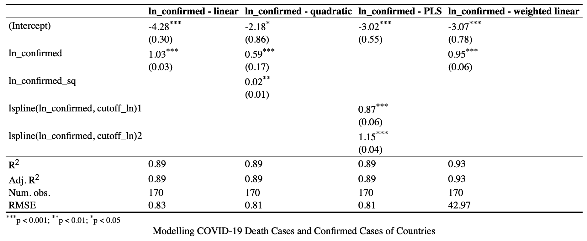

\vspace{-30truemm}

### Introduction
\vspace{-3truemm}
In this exercise, the main aim is to find the relationship between COVID-19 confirmed cases and its death cases across countries. Do they correlate with each other? If so, how? The variables I have in this analysis are list of country names where data was collected, counts of COVID19 confirmed cases include confirmed and probable (where reported), counts of COVID19 death cases include confirmed and probable (where reported), counts of estimated COVID19 recovered cases, counts of COVID19 active cases, and 2019 country population count in ten thousands. The population data is included becasue I am also interested to see if country's population would play a part in later analysis. One potential data quality issue would be the reliability of the data, if countries reported their true information.

The dependent variable here is death cases, and indepedent variable is confirmed cases. population data will be needed in later analysis for weighted regression. It is scaled in the data cleaning process with 10,000. Since the purpose of my analysis is to find the relationship between confirmed cases and death cases from countries, and due to my limited sample size, I have decided not to drop any data.


```{r, message=FALSE, echo=FALSE, results = FALSE}
chooseCRANmirror(graphics=FALSE, ind=1)
knitr::opts_chunk$set(echo = TRUE)
library(tidyverse)
require(scales)
install.packages("lspline")
library(lspline)
install.packages("estimatr")
library(estimatr)
install.packages("texreg")
library(texreg)
install.packages("ggthemes")
library(ggthemes)
library(psych)
my_url <- "https://raw.githubusercontent.com/XinqiW/DA2_and_Coding1_Assign_COVID19/main/Data/Clean/covid_pop_10_13_2020_clean.csv"
df <- read.csv(my_url)
```

The combined histograms below shows the key variables used in this anlysis: my x variable: confimred, my y variable: death, and weighted variable: population. From the summary statistics table below, both confirmed and death variable's mean are higher than median, which means that both of them are skewed to the right, and have a long right tail. We can see that from the histograms as well.

```{r out.height="30%", message=FALSE, echo=FALSE, results = FALSE, fig.cap="Histograms of Key Variables"}

df %>%
  select(-one_of(c('recovered', 'active'))) %>% 
  keep(is.numeric) %>% 
  gather() %>% 
  ggplot(aes(value)) +
  facet_wrap(~key, scales = "free") +
  geom_histogram() 
```

```{r set-options, echo=FALSE, cache=FALSE}
options(width = 80)
df %>%
  select(-one_of(c('recovered', 'active'))) %>% 
  summary()
```

Next, I have to consider whether and where to use **log transformation**. I have 4 options here: **level-level**, **level-log**, **log-level** and **log-log**. I have tried each of them and plotted them with lo(w)ess for different scatterplots. The graphs are in the Appendix as figure 2 and 3. Based on the outputs, I decided to log both of my x and y. My **substantive reasons** are: Firstly, level changes is harder to interpret and our aim is not to get absolute based comparison. Secondly, log-log gives a better interpretation with percentage increases or decreases in confirmed and death cases. Finally, log transformation is a better approximation to make simplification. My **statistical reasons** are: It makes sense to take log as my variables have skewed distribution with long right tail. Since the  distribustions of confirmed and death cases are skewed with a long right tail, taking natural log makes them closer to symmetric. The same results can be shown in figure 3, where the log-log transformation scatterplot gives the most linear relationship between 2 variables.

**In the next session, I examine 4 potential models to use in my analysis:**

1. **The Simple Linear Regression Model (reg1)**:
\setlength{\abovedisplayskip}{3pt}
\setlength{\belowdisplayskip}{3pt}
$$ln(death) = \alpha + \beta * ln(confirmed) $$
The slope of this regression is 1.03, means that death cases is higher, on average, by approximately 10.3% in countries with 10% higher in confirmed cases. The adj-$R^2$ is 0.89 which is pretty high. 

The rest of the models are in the Appendix, there I compare the rest of three models with the Simple Regression Model (reg1). Based on model comparison, my choice is to go with **reg1 - Simple linear regression** (ln_death ~ ln_confirmed)
   My **substantive reasons** are: 
   1. log-log interpretation works properly for countries, and
   2. magnitude of coefficients are meaningful. My **statistical reasons** are: 
   1. simple model, easy to interpret, and
   2. Comparatively high $R^2$ and captures variation well (A more detailed explainations on model comparisons and selections are in the Appendix). 

In this analysis, those more complicated specifications (reg2-reg4) didn't lead to very different conclusions becasue the pattern of association turned out to be fairly linear overall.

Next, a **hypothesis test** on $\beta$ is conducted. I want to know if dependent variable and the explanatory variable are related at all? The significance level I choose is at 0.05. Baesd on the output table in the Appendix, the p value of the hypothesis is < 2.2e-16 which is much lower than 0.05. Meaning that beta cannot be 0 and we should reject the null at significance level 0.05, and x and y are related. Below is the result table:
```{r, message=FALSE, echo=FALSE, results = FALSE}
library(car)

# Filter out countries with 0 death in order to take log of death:
df<- df %>% filter(!death==0)

# Take Log of confirmed and death
df <- df %>% mutate( ln_confirmed = log( confirmed ),
                     ln_death = log( death )) 

# First model: Simple linear regression (log-log):
reg1 <- lm_robust( ln_death ~ ln_confirmed , data = df , se_type = "HC2" )

# Carry out the following test: H0 : beta = 0; HA : beta != 0
linearHypothesis( reg1 , "ln_confirmed = 0")
```

**Summary Statistics for Hypithesis Testing**
\vspace{-5truemm}
```{r set-options2, echo=FALSE, cache=FALSE, table.cap="Summary Statistics for Hypithesis Testing"}
library(car)
linearHypothesis( reg1 , "ln_confirmed = 0")
```
\vspace{-5truemm}

Finally, I analyse the **residuals**. The top 5 countries who **lost** (relatively) the most people due to COVID are: **Burundi** (y = 0, $\hat{y}$ = 2.19), **Iceland** (y = 2.30, $\hat{y}$ = 4.18), **Qatar** (y = 5.39, $\hat{y}$ = 7.84), **Singapore** (y = 3.33, $\hat{y}$ = 7.02) and **Sri Lanka** (y = 2.56, $\hat{y}$ = 4.51). These countries are the ones with largest negative errors, which are also the ones that lies most far above the fitted line, that's why they are considered to be the ones who lost (relatively) the most people. On the other hand, the top 5 countries who **saved** (relatively) the most people due to COVID are: **Ecuador** (y = 9.41, $\hat{y}$ = 7.99), **Fiji** (y = 0.69, $\hat{y}$ = -0.70), **Italy** (y = 10.50, $\hat{y}$ = 8.92), **Mexico** (y = 11.34, $\hat{y}$ = 9.76), and **Yamen** (y = 6.39, $\hat{y}$ = 3.58). Similarly, these countries are the ones with largest positive errors, which are also the ones that lies most far below the fitted line, that's why they are considered to be the ones who saved (relatively) the most poeple.  

```{r, message=FALSE, echo=FALSE, results = FALSE}
# Get the predicted y values from the model
df$reg1_y_pred <- reg1$fitted.values

# Calculate the errors of the model
df$reg1_res <- df$ln_death - df$reg1_y_pred 

# Find countries with largest negative errors
df %>% top_n( -5 , reg1_res ) %>% 
  select( country , ln_death , reg1_y_pred , reg1_res )

# Find countries with largest positive errors
df %>% top_n( 5 , reg1_res ) %>% 
  select( country , ln_death , reg1_y_pred , reg1_res )
```


To conclude, in this analysis, I use ln(confirmed) as my independent variable, and ln(death) as my dependent variable. The general pattern between these two variables is mostly linear. I choose to use the most simple linear regression model which gives the best fit and easy to interpret. The mean message from the results is death cases is higher, on average, by approximately 10.3% in countries with 10% higher in confirmed cases of COVID-19. The main advantage of this model is its simplicity and relatively high fits of my data. One weakness would be that linear regression only look at the mean of the dependent variable and the independent variables. However, sometimes we need to look at the extremes of the dependent variable, e.g., countries are at risk when they have extrame high numbers in death count, so we would want to look at the extremes in this example.


\newpage

### Appendix


```{r, figures-side, fig.show="hold", out.width="50%", echo=FALSE, message=FALSE, warning=FALSE, fig.cap="Level-level model without Scaling and Level-log model with Scaling for Confirmed"}
# 1) a). confirmed - death: level-level model without scaling
par(mar = c(4, 4, .1, .1))
ggplot( df , aes(x = confirmed, y = death)) +
  geom_point(color='orange') +
  geom_smooth(method="loess", color = 'dodgerblue3')+
  labs(x = "confirmed cases",y = "death cases") 

# b). confirmed - death: change the scale for confirmed cases for checking log-transformation (level-log model)
ggplot( df , aes(x = confirmed, y = death)) +
  geom_point(color='orange') +
  geom_smooth(method="loess", color = 'dodgerblue3')+
  labs(x = "confirmed cases, ln scale",y = "death case") +
  scale_x_continuous( trans = log_trans(),  breaks = c(1000,10000,80000,900000,5000000) )
```


```{r, figures-side2, fig.show="hold", out.width="50%", echo=FALSE, message=FALSE, warning=FALSE, fig.cap="Log-level model with Scaling for Death and Log-log model with Scaling for both Confirmed and Death"}

# c). confirmed - death: change the scale for death cases for checking log-transformation (log-level model)
par(mar = c(4, 4, .1, .1))
ggplot( df , aes(x = confirmed, y = death)) +
  geom_point(color='orange') +
  geom_smooth(method="loess", color = 'dodgerblue3')+
  labs(x = "confirmed cases, ln scale",y = "death case") +
  scale_y_continuous( trans = log_trans(),  breaks = c(1,20,50,200,1000,10000,80000) )

# d). confirmed - death: change the scale for confirmed cases and death cases for checking log-transformation (log-log model)
ggplot( df , aes(x = confirmed, y = death ))  +
  geom_point(color='orange') +
  geom_smooth(method="loess", color = 'dodgerblue3')+
  labs(x = "confirmed cases, ln scale",y = "death case, ln scale") +
  scale_x_continuous( trans = log_trans() , breaks = c(1000,10000,80000,900000,5000000) )+
  scale_y_continuous( trans = log_trans(), breaks = c(1,20,50,200,1000,10000,80000) )

```

\newpage


```{r, message=FALSE, echo=FALSE, results = FALSE}
# Filter out countries with 0 death in order to take log of death:
df<- df %>% filter(!death==0)

# Take Log of confirmed and death
df <- df %>% mutate( ln_confirmed = log( confirmed ),
                     ln_death = log( death )) 

```             


```{r, message=FALSE, echo=FALSE, results = FALSE}
df <- df %>% mutate( ln_confirmed_sq = ln_confirmed^2,
                     ln_confirmed_cb = ln_confirmed^3)
```                     


2. **The Quadratic (Linear) Regression Model (reg2)**:
\setlength{\abovedisplayskip}{3pt}
\setlength{\belowdisplayskip}{3pt}
$$ln(death) = \alpha + \beta_1 * ln(confirmed) + \beta_2 * ln(confirmed)^2$$
The graph shows the quadratic fit settles for slight nonlinearity. The pattern is a positive association through the entire range of observed ln_confirmed. Based on the summary statistics in figure 6, the two slope parameters are 0.59 and 0.02, with no clear interpretation except the second, positive, number showing that the parabola is convex. It didn't lead to very different conclusions with the simple linear model because the pattern of association turned out to be fairly linear overall. 

```{r, figures-side3, fig.show="hold", out.width="50%", echo=FALSE, message=FALSE, warning=FALSE, fig.cap="Simple Linear Regression (reg1) and Quadratic (Linear) Regression (reg2)"}
par(mar = c(4, 4, .1, .1))
# First model: Simple linear regression (log-log):
reg1 <- lm_robust( ln_death ~ ln_confirmed , data = df , se_type = "HC2" )
# Visual inspection:
ggplot( data = df, aes( x = ln_confirmed, y = ln_death ) ) + 
  geom_point( color='orange') +
  geom_smooth( method = lm , color = 'dodgerblue3' )

# Second model: Quadratic (linear) regression (reg2):
reg2 <- lm_robust( ln_death ~ ln_confirmed + ln_confirmed_sq , data = df )
ggplot( data = df, aes( x = ln_confirmed, y = ln_death ) ) + 
  geom_point( color='orange') +
  geom_smooth( formula = y ~ poly(x,2) , method = lm , color = 'dodgerblue3' )
```
3. **The Piecewise Linear Spline Regression Model (reg3)**:
\setlength{\abovedisplayskip}{3pt}
\setlength{\belowdisplayskip}{3pt}
$$ln(death) = \alpha + \beta_1 * ln(confirmed) * 1(confirmed < 15000) + \beta_2 * ln(confirmed) * 1(confirmed >= 15000)$$
The slope of first line segment is 0.87, just a little flatter than reg1- the simple linear regression, where the slope is 1.03. The slope of the other line segment is 1.15. Comparing countries with confirmed cases below 15000, death cases is higher, on average, by approximately 8.7% in countries with 10% higher in confirmed cases. With confirmed cases above 15000, death cases is also higher, on average, by approximately 11.5% in countries with 10% higher in confirmed cases. The adj-$R^2$ is 0.89 here, same with the one from the simple linear regression. The improvement on the fit is very small in this case and only provides a better fit for only a few observations.

```{r, figures-side4, fig.show="hold", out.width="50%", echo=FALSE, message=FALSE, warning=FALSE, fig.cap="Piecewise Linear Spline Regression (reg3) and Weighted Linear Regression (using Population as Weights) (reg4)"}
par(mar = c(4, 4, .1, .1))
# Third model: Piecewise linear spline regression:
# 1st: define the cutoff for confirmed
cutoff <- 15000
# 2nd: log transformation cutoff
cutoff_ln<- log( cutoff )
# Use simple regression with the lspline function
reg3 <- lm_robust(ln_death ~ lspline( ln_confirmed , cutoff_ln ), data = df )
ggplot( data = df, aes( x = ln_confirmed, y = ln_death ) ) + 
  geom_point( color='orange') +
  geom_smooth( formula = y ~ lspline(x,cutoff_ln) , method = lm , color = 'dodgerblue3' )

# Fourth model: Weighted-OLS: use reg1 setup and weight with population
reg4 <- lm_robust(ln_death ~ ln_confirmed, data = df , weights = population)

ggplot(data = df, aes(x = ln_confirmed, y = ln_death)) +
  geom_point(data = df, aes(size=population),  color = 'orange', shape = 16, alpha = 0.6,  show.legend=F) +
  geom_smooth(aes(weight = population), method = "lm", color='dodgerblue3')+
  scale_size(range = c(1, 15)) +
  coord_cartesian(ylim = c(0, 15)) +
  labs(x = "ln(Confirmed) ",y = "ln(Death)")+
  annotate("text", x = 11.417053, y = 8.4635814, label = "China", size=5)+
  annotate("text", x = 15.795047,  y = 11.6135488, label = "India", size=5)
```

4. **The Weighted Linear Regression, using Population as Weights (reg4)**:
\setlength{\abovedisplayskip}{3pt}
\setlength{\belowdisplayskip}{3pt}
$$ln(death) = \alpha + \beta * ln(confirmed), weights: population$$
The scatterplot for the weighted regression shows the size of each country: the area of the circle is proportionate to their population. The same linear regression using population as weight gives a slope of 0.95, which turns out to be similar. This shows that countries with 10% more confimred cases have, on average, 9.5% more death cases. The adj-$R^2$ is improved by 0.04 compare with reg1, but is not a big difference. And RMSE is very high at 42.97 reflects the poor ability of the model to accurately predict the data even though my goal here is not model prediction, it is worthwhile to point out. Overall, the two regressions (reg1 and reg4) show similar results because larger countries do not tilt the regression line much. As the weighted regression produces results that are similar to the unweighted regression.

```{r, message=FALSE, echo=FALSE, results = FALSE}
# Creating model summary with texreg
data_out <- "../Output/"
htmlreg( list(reg1 , reg2 , reg3 , reg4 ),
         type = 'html',
         custom.model.names = c("ln_confirmed - linear","ln_confirmed - quadratic",
                                "ln_confirmed - PLS", "ln_confirmed - weighted linear"),
         caption = "Modelling COVID-19 Death Cases and Confirmed Cases of Countries",
         file = paste0( data_out ,'model_comparison.html'), include.ci = FALSE)

```

Figure 6 gives the summary statistics for the 4 model regressions results. 

```{r pressure, echo=FALSE, fig.cap="Modelling COVID-19 Death Cases and Confirmed Cases of Countries", out.width = '100%'}

```
